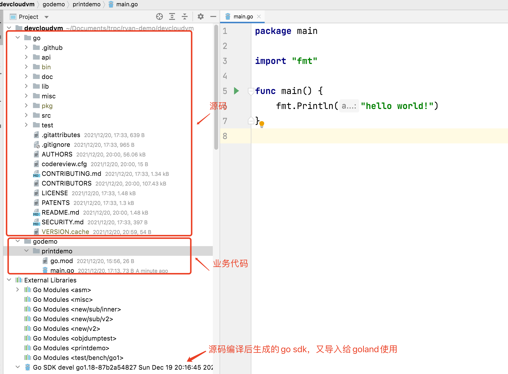
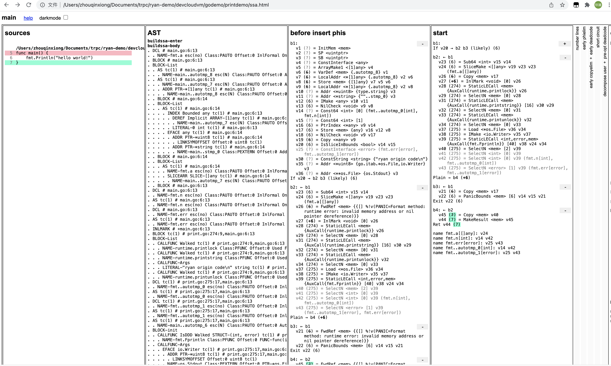

# Go源码编译

## 环境

操作系统：macos 11.2.3

IDE：goland 2021.2.1

go源码：[https://github.com/golang/go](https://github.com/golang/go)

## 源代码下载

```
git  clone git@github.com:golang/go.git
```

查看下当前go源码的情况，有165+万行源代码，这个会随着版本的升级而不算增加

```
zhouqinxiong@RYANQXZHOU-MB0 devcloudvm % cd go
zhouqinxiong@RYANQXZHOU-MB0 go % cloc src 
    7334 text files.
    5515 unique files.                                          
    2136 files ignored.

7 errors:
Line count, exceeded timeout:  src/cmd/dist/build.go
Line count, exceeded timeout:  src/net/http/requestwrite_test.go
Line count, exceeded timeout:  src/vendor/golang.org/x/net/idna/tables10.0.0.go
Line count, exceeded timeout:  src/vendor/golang.org/x/net/idna/tables11.0.0.go
Line count, exceeded timeout:  src/vendor/golang.org/x/net/idna/tables12.0.0.go
Line count, exceeded timeout:  src/vendor/golang.org/x/net/idna/tables13.0.0.go
Line count, exceeded timeout:  src/vendor/golang.org/x/net/idna/tables9.0.0.go

github.com/AlDanial/cloc v 1.92  T=39.04 s (141.3 files/s, 54545.2 lines/s)
-----------------------------------------------------------------------------------
Language                         files          blank        comment           code
-----------------------------------------------------------------------------------
Go                                4863         158716         280417        1523649
Assembly                           487          13720          20092         114379
C                                   75            804            615           4889
CSV                                  1              0              0           2119
JSON                                12              0              0           1712
Markdown                             9            414              0           1459
Bourne Shell                        11            184            774           1352
Perl                                10            173            171           1109
Bourne Again Shell                  12            101            208            460
Python                               1            133            104            374
C/C++ Header                        12             71            202            229
DOS Batch                            5             57             72            187
Windows Resource File                4             23              0            143
Logos                                2             16              0            102
C++                                  1              8              9             17
Objective-C                          1              2              3             11
awk                                  1              1              6              7
make                                 4              3              7              7
Dockerfile                           1              3              3              6
MATLAB                               1              1              0              4
CSS                                  1              0              0              1
HTML                                 1              0              0              1
-----------------------------------------------------------------------------------
SUM:                              5515         174430         302683        1652217
-----------------------------------------------------------------------------------

```

## 源代码编译

### 修改源码

goland上打开源代码目录，修改src/fmt/print.go文件，在Println方法上新增自己的代码：

```
func Println(a ...any) (n int, err error) {
	println("ryan source code")    //新增代码
	return Fprintln(os.Stdout, a...)
}
```

### 编译源码

进入src目录，执行**./make.bash**，这里是利用go自举编译，所以需要有go的环境，这里要求go 版本大于1.4即可。&#x20;

```
zhouqinxiong@RYANQXZHOU-MB0 go % cd src 
zhouqinxiong@RYANQXZHOU-MB0 src % ./make.bash 
Building Go cmd/dist using /usr/local/Cellar/go/1.16.6/libexec. (go1.16.6 darwin/amd64)
Building Go toolchain1 using /usr/local/Cellar/go/1.16.6/libexec.
Building Go bootstrap cmd/go (go_bootstrap) using Go toolchain1.
Building Go toolchain2 using go_bootstrap and Go toolchain1.
Building Go toolchain3 using go_bootstrap and Go toolchain2.
Building packages and commands for darwin/amd64.
---
Installed Go for darwin/amd64 in /Users/zhouqinxiong/Documents/trpc/ryan-demo/devcloudvm/go
Installed commands in /Users/zhouqinxiong/Documents/trpc/ryan-demo/devcloudvm/go/bin

```

### 执行业务代码

业务代码：

```
package main
import "fmt"
func main() {
	fmt.Println("hello world!")
}
```

执行业务代码：

```
zhouqinxiong@RYANQXZHOU-MB0 devcloudvm % /Users/zhouqinxiong/Documents/trpc/ryan-demo/devcloudvm/go/bin/go run godemo/printdemo/main.go             
ryan source code
hello world!
```

可以看到，输出了业务日志的同时，也输出了我们自定义的代码

## IDE展示

### 工程展示

为了阅读代码，在goland上open源码目录后，展示如下：



### 运行展示

.png>)

## 中间代码

将Go语言的源代码编译成汇编语言

```
zhouqinxiong@RYANQXZHOU-MB0 printdemo % go build -gcflags -S main.go 
# command-line-arguments
"".main STEXT size=126 args=0x0 locals=0x40 funcid=0x0 align=0x0
        0x0000 00000 (/Users/zhouqinxiong/Documents/trpc/ryan-demo/devcloudvm/godemo/printdemo/main.go:5)       TEXT    "".main(SB), ABIInternal, $64-0
        0x0000 00000 (/Users/zhouqinxiong/Documents/trpc/ryan-demo/devcloudvm/godemo/printdemo/main.go:5)       CMPQ    SP, 16(R14)
        0x0004 00004 (/Users/zhouqinxiong/Documents/trpc/ryan-demo/devcloudvm/godemo/printdemo/main.go:5)       PCDATA  $0, $-2
        0x0004 00004 (/Users/zhouqinxiong/Documents/trpc/ryan-demo/devcloudvm/godemo/printdemo/main.go:5)       JLS     119
        0x0006 00006 (/Users/zhouqinxiong/Documents/trpc/ryan-demo/devcloudvm/godemo/printdemo/main.go:5)       PCDATA  $0, $-1
        0x0006 00006 (/Users/zhouqinxiong/Documents/trpc/ryan-demo/devcloudvm/godemo/printdemo/main.go:5)       SUBQ    $64, SP

```

生成ssa.html文件，方便开发者分析编译优化过程

```
zhouqinxiong@RYANQXZHOU-MB0 printdemo % GOSSAFUNC=main go build main.go 
# runtime
dumped SSA to /Users/zhouqinxiong/Documents/trpc/ryan-demo/devcloudvm/godemo/printdemo/ssa.html
# command-line-arguments
dumped SSA to ./ssa.html

```


